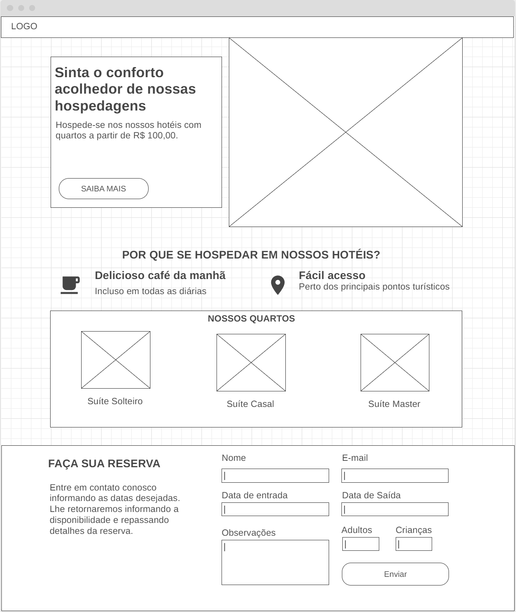

# Atividade 4
 
## Contexto
A equipe de desenvolvimento está empenhada em melhorias na qualidade dos websites criados. Uma das diretrizes de desenvolvimento agora é que os sites precisam ser responsivos – ou seja, devem se comportar bem em diferentes resoluções de tela. Para isso, está sendo usado o framework Bootstrap, que traz ferramentas úteis nessa tarefa. Você deve montar uma página responsiva, solicitada para um hotel da região, usando Bootstrap.

## Atividade
Usando o Bootstrap, crie uma página que corresponda ao seguinte wireframe. Escolha cores e imagens harmoniosas com o contexto do website.

# Atividade 5

## Contexto
O hotel que solicitou a página proposta na atividade anterior está empolgado com os resultados. Para demonstrar um pouco mais das funcionalidades da página, propõe-se a simulação de postagens e de recuperação de dados. Para isso, será usado o simulador de serviços web JSON Server.
 
## Atividade
* Configure um novo serviço simulado no JSON Server.
* Envie os dados do formulário presente no rodapé da página para esse serviço. É opcional o uso de AJAX para a postagem.
* Crie uma nova página HTML com uma tabela. Ao carregar a página, preencha-a com as informações registradas de solicitações de reservas realizadas no site.